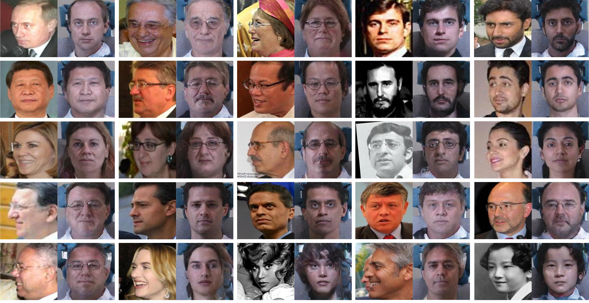
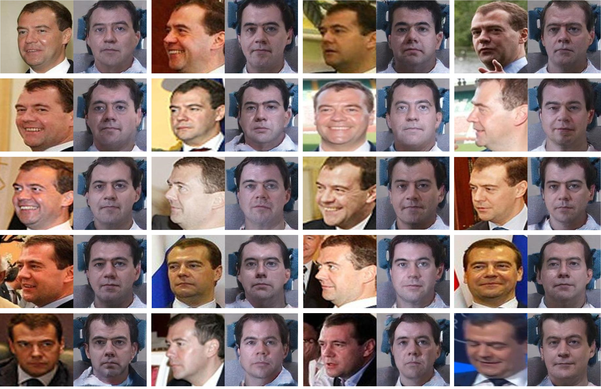

# Unsupervised Face Normalization with Extreme Pose and Expression in the Wild--

This repository contains training code for the paper

Unsupervised Face Normalization with Extreme Pose and Expression in the Wild
(The paper will be released soon.)

The model learns to generate a frontal, neutral expression, photorealistic face image from one face image in the wild.

## Usage

### Prerequisites
- Python 2.7
- Tensowflow 1.8.0

### Prepare Datasets

We used [CASIA-Webface](http://www.cbsr.ia.ac.cn/english/CASIA-WebFace-Database.html)  for non-normal face set and [Multi-PIE](http://www.cs.cmu.edu/afs/cs/project/PIE/MultiPie/Multi-Pie/Home.html) for normal face set in the unconstrained experiment. We can not redistribute the original dataset due to copyright. For normal face set, you can use other public-available datasets that has highly-normalled faces.

All face images are detected by [MTCNN](https://github.com/kpzhang93/MTCNN_face_detection_alignment), and then cropped.

## Pretrained models(release soon)

* [Face expert network, VGG-Face2]()
* [FNM]()

### Train and test

- Train
After unnormal face images and normal face images are ready, make image list respectively.
Modify image path and list path, etc, in **config.py**.
```
python main.py
```
- Test
```
python test.py --test_path your_test_path --test_list your_test_list --checkpoint_ft pretrained_model_path
```

### Adjust face attention region

If you use other dataset for normal face set, please modify the attention discriminators (**WGAN.py**) according to the face region.

### Notes

- The identity perception loss (L_ip) is slightly modified. Cosine distance is used other than mean square error.
- 

## Citation and Contact
If you find FNM useful in your research, please consider citing:
```
@inproceedings{FNM,
  author = {Qian, Yichen and Deng, Weihong and Hu, Jiani},
  booktitle = {IEEE Conference on Computer Vision and Pattern Recognition},
  title = {Unsupervised Face Normalization with Extreme Pose and Expression in the Wild},
  year = {2019}
}
```
